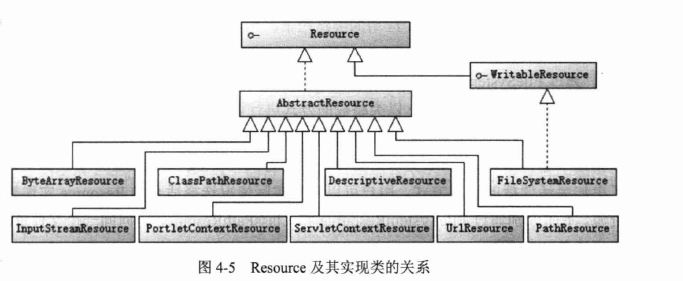
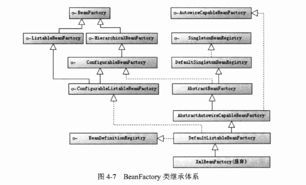
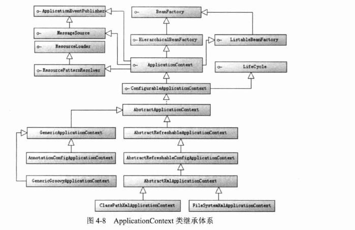
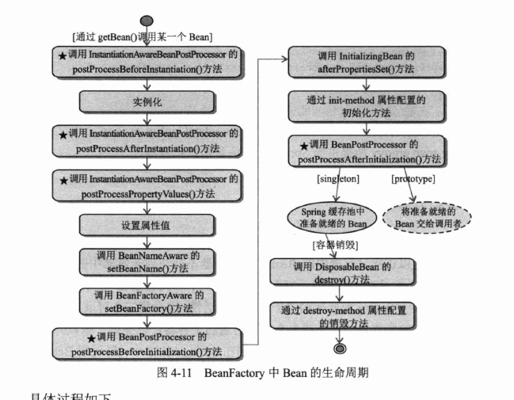
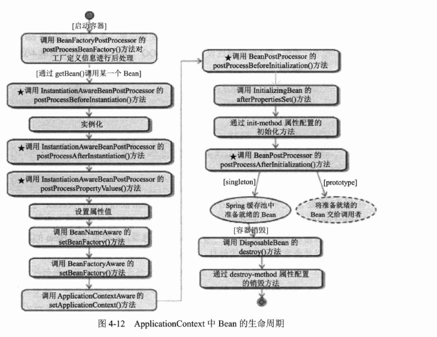
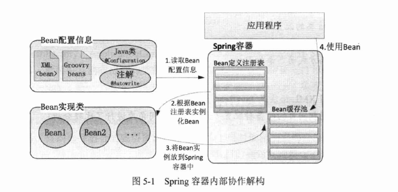
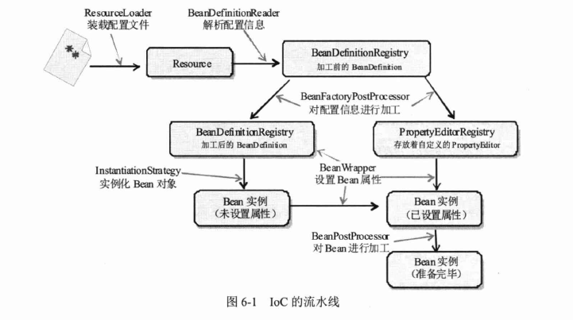
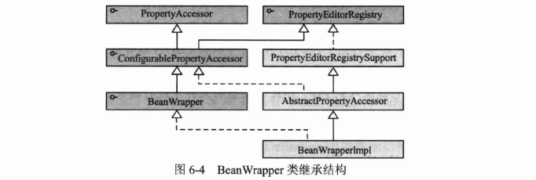
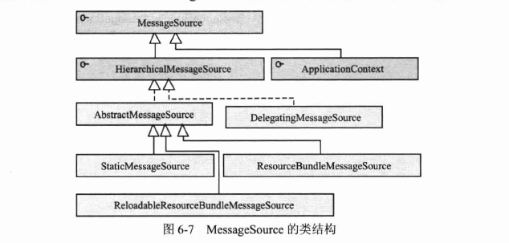
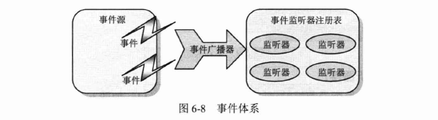

## Spring

### 一 IOC

#### 1.1 IOC概述

##### 1.1.2 IOC类型

> 1. 构造函数注入
> 2. 属性注入
> 3. 接口注入

#### 1.3 资源访问

##### 1.3.1 资源抽象接口



#### 1.4 BeanFactory和ApplicationContext

> BeanFactory面向Spring本身，ApplicationContext面向使用Spring框架的开发者。

**BeanFactory**




**ApplicationContext**




#### 1.5 Bean的生命周期




**ApplicationContext**




### 二 在IoC容器中装配Bean

#### 2.1 Spring容器高层视图

> 

### 三 Spring容器高级主题

#### 3.1 Spring 容器技术内幕

##### 3.1.1 内部工作机制

> ```java
> 			// Prepare this context for refreshing.
> 			prepareRefresh();
> 			// Tell the subclass to refresh the internal bean factory.
> 			ConfigurableListableBeanFactory beanFactory = obtainFreshBeanFactory();
> 			// Prepare the bean factory for use in this context.
> 			prepareBeanFactory(beanFactory);
>             // Allows post-processing of the bean factory in context subclasses.
>             postProcessBeanFactory(beanFactory);
>             // Invoke factory processors registered as beans in the context.
>             invokeBeanFactoryPostProcessors(beanFactory);
>             // Register bean processors that intercept bean creation.
>             registerBeanPostProcessors(beanFactory);
>             // Initialize message source for this context.
>             initMessageSource();
>             // Initialize event multicaster for this context.
>             initApplicationEventMulticaster();
>             // Initialize other special beans in specific context subclasses.
>             onRefresh();
>             // Check for listener beans and register them.
>             registerListeners();
>             // Instantiate all remaining (non-lazy-init) singletons.
>             finishBeanFactoryInitialization(beanFactory);
>             // Last step: publish corresponding event.
>             finishRefresh();
> 			
> ```
>
> 1. 准备刷新工作
> 2. 初始化对象工厂BeanFactory
> 3. 准备BeanFactory
> 4. 注册工厂后处理器方法，由子类完成
> 5. 调用beanFactory后处理方法
> 6. 注册对象后处理器
> 7. 初始化消息源
> 8. 初始化应用事件广播器
> 9. 初始化其他特殊的对象，由子类实现
> 10. 注册监听器
> 11. 初始化所有单例的对象，懒加载的除外
> 12. 结束刷新工作并发布容器刷新事件
>
> 

##### 3.1.2 BeanDefinition

> spring通过BeanDefinition将<bean>标签转换为spring中的内部表示，并将这些BeanDefinition注册到BeanDefinitionRegistry中。BeanDefinitionRegistry就像Spring的内存数据库，Spring之后从其中获得对象的配置信息。

##### 3.1.3 InstantiationStrategy

> 该类负责根据BeanDefinition对象创建一个Bean实例。相当于Java对象的new工作。

##### 3.1.4 BeanWrapper

> 主要负责完成Bean属性的填充工作。主要有三重身份：Bean包裹器，属性访问器，属性编辑器注册表。
>
> 

#### 3.2属性编辑器

> 属性编辑器的主要功能就是将外部的设置值转化为JVM内部的对应类型，所以其也就是一个类型转化器。

##### 3.2.1 JavaBean的编辑器

1. > * A PropertyEditor class provides support for GUIs that want to
   >
   >   allow users to edit a property value of a given type.

2. > - a {@code BeanInfo} class provide explicit information about the methods, properties, events, and other features of your beans.

3. 实例

##### 3.2.2 Spring 默认属性编辑器

> PropertyEditorRegistrySupport类，将配置文件中写好的属性转化为实际对象的属性值。

##### 3.2.3 自定义属性编辑器

> 若使用BeanFactory，则需要调用registerCustomEditor方法；若使用ApplicationContext，则只需在配置文件中通过CustomEditorConfigurer注册即可。

#### 3.3 使用外部属性文件

> 优点：减少工作量，使部署更加简单。

##### 3.3.1 PropertyPlaceholderConfigurer属性文件

> {@link PlaceholderConfigurerSupport} subclass that resolves ${...} placeholders
>
> against {@link #setLocation local} {@link #setProperties properties} and/or system properties and environment variables.

##### 3.3.2 使用加密的属性文件

> 步骤：
>
> 1. 继承PropertyPlaceholderConfigurer类
> 2. 根据需要覆盖convertProperty方法、convertProperties方法或convertPropertyValue方法。

#### 3.5 国际化信息

> MessageSource层级结构
>
> 

#### 3.6 容器事件

**三个重要概念：**

> - 事件源：事件的产生者。
> - 事件监听器注册表：当事件源产生事件时，就会通知这些位于事件监听器注册表中的监听器。
> - 事件广播器：事件与事件监听器沟通的桥梁。
>
> 

##### 3.6.1 Spring事件类结构

> 1. 事件类:
>
>    > 
>
>    ​