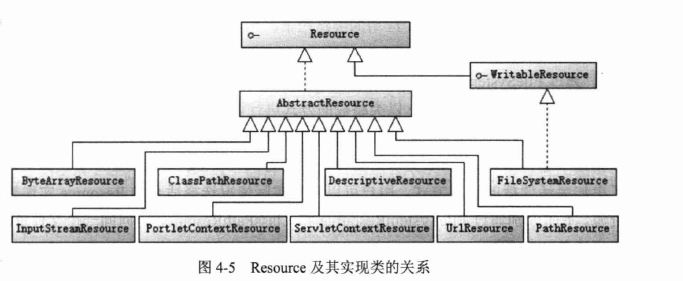
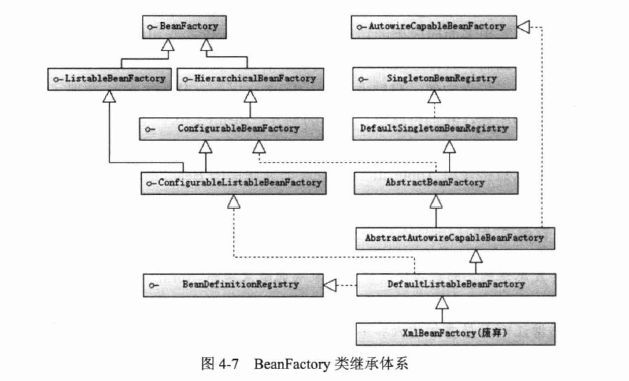
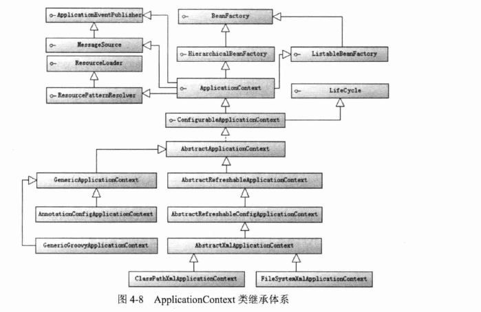

## Spring

### 一 IOC

#### 1.1 IOC概述

##### 1.1.2 IOC类型

> 1. 构造函数注入
> 2. 属性注入
> 3. 接口注入

#### 1.3 资源访问

##### 1.3.1 资源抽象接口

#### 1.4 BeanFactory和ApplicationContext

> BeanFactory面向Spring本身，ApplicationContext面向使用Spring框架的开发者。

**BeanFactory**

**ApplicationContext**

#### 1.5 Bean的生命周期

