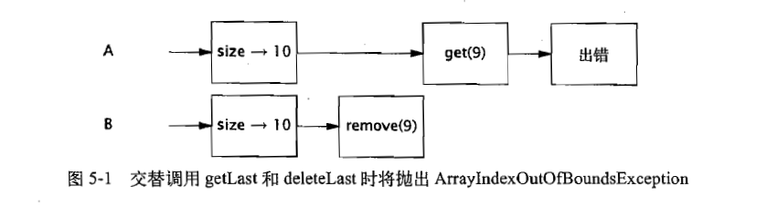
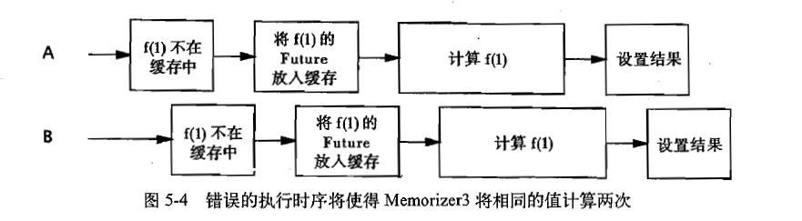

## 并发编程实战

### 一 简介

#### 1.1 并发简史

> 一次占用全部的计算资源严重浪费现有资源。因此操作系统提供了进程，进程是最基本的资源配置单元。线程是轻量级的进程，线程是最基本的资源调度单元。

#### 1.2 线程的优势

> 线程可以降低程序的开发（？）和维护成本，同时提升复杂应用程序的性能。

##### 1.2.1 发挥多核处理器的强大能力

> 合理使用线程在多核处理器的机器上能够提高系统吞吐率。

##### 1.2.2 建模的简单性

> 将多种任务通过线程区分成单独的任务。从而使线程内的代码只用关注自己的逻辑。

##### 1.2.3 异步事件的简化处理

> 例如Socket开发。

##### 1.2.4 响应更灵敏的用户界面

#### 1.3 线程带来的风险

##### 1.3.1 安全性问题

```java
@NotThreadSafe
public class UnsafeSequence{
  private int value;
  
  public int getNext(){
    return value++;
  }
}
```


> 若要使上面的方法安全执行，则需要同步代码，通过同步代码块或者同步方法。

##### 1.3.2 活跃性问题

**安全性定义**：永远不发生糟糕的事情。

**活跃性定义** ：某件正确的事情最终会发生。（线程中死锁）

##### 1.3.3 性能问题

> 上下文切换（临时挂起一个活跃线程转而运行另一个线程。保存和恢复执行上下文，丢失局部性。同步机制会抑制编译器优化，增加内存总线的同步流量）

#### 1.4 线程无处不在

> Servlet(ServletContext，HttpSession)。Swing、AWT。RMI

### 二 线程安全性

> 一个对象是否需要是线程安全的，取决于它是否被多个线程访问。这指的是访问对象的方式，而不是对象要实现的功能。

**Java中的主要同步机制**:

> synchronized（独占的加锁方式），volatile，显式锁（Explicit Lock）以及原子变量。

> 线程安全性是一个在代码上使用的术语，但它只是与状态相关，因此只能应用于**封装其状态**的整个代码，这可能是一个对象，也可能是整个程序。

#### 2.1 什么是线程安全性

**正确性** ：某个类的行为与其规范完全一致。

**线程安全性** ：当多个线程访问某个类时，这个类始终都能表现出正确的行为，则这个类就是线程安全的。

**无状态对象一定是线程安全的。**

#### 2.2 原子性

**竞态条件（Race Condition）：**由于不恰当的执行时序而出现不正确的结果。

##### 2.2.1 竞态条件

> 得到正确结果必须取决于事件的发生时序。
>
> **先检查后执行：**首先观察到某个条件为真，然后根据观察结果采用相应的动作。

##### 2.2.2 延迟初始化中的竞态条件

```java
@NotThreadSafe
public class LazyInitRace{
  private ExpensiveObject instance = null;
  
  public ExpensiveObject getInstance(){
    if( null == instance){
      instance = new ExpensiveObject();
    }
    return instance;
  }
}
```

##### 2.2.3 复合操作

> 原子操作是指，对于访问同一个状态的所有操作（包括该操作本身）来说。这个操作是一个以原子方式执行的操作。

**复合操作：**包含了一组必须以原子方式执行的操作以确保线程安全性。

> 在实际并发编程中，应尽可能地使用现有的线程安全对象来管理类的状态。

#### 2.3 加锁机制

> **要保持状态的一致性，就需要在单个原子操作中更新所有相关的状态变量。**

##### 2.3.1 内置锁

> 以关键字synchronized来修饰的方法就是一种横跨整个方法体的同步代码块，其中该同步代码块的锁就是方法调用所在的对象。Java的内置锁相当于一种**互斥体（或互斥锁）**。即线程A尝试获取一个由线程B持有的锁时，线程A必须等待或者阻塞，直到线程B释放这个锁。

##### 2.3.2 重入

> 内置锁是可重入的。这意味着获取锁的操作粒度是“线程”，而不是“调用”。

```java
public class Widget{
  public synchronized void doSomething(){
    //...
  }
}
public class LoggingWidget extends Widget{
  public synchronized void doSomething(){
    System.out.println(toString()+" :calling doSomething.");
    super.doSomething(); //若内置锁不可重入，则该方法会产生死锁。    
  }
}
```

#### 2.4 用锁来保护状态

> 对于可能被多个线程同时访问的可变状态变量，在访问它时都需要持有同一个锁，在这种情况下，我们称状态变量是由这个锁保护的。

> 每个共享的和可变的变量都应该只由一个锁来保护，从而使维护人员知道是哪一个锁。

> 对于每个包含多个变量的不变性条件，其中涉及的所有变量都需要由同一个锁来保护。

#### 2.5 活跃性与性能


> 通常，在简单性和性能之间存在着相互制约因素。

> **当执行时间较长的计算或者可能无法快速完成的操作时（网络I/O、控制台I/O），一定不要持有锁**

### 三 对象的共享

> 上一章介绍了如何通过同步来避免多个线程在同一时刻访问相同的数据，而这一章将介绍如何共享和发布对象，从而使他们能够安全地由多个线程同时访问。

#### 3.1可见性

> 通常，我们无法确保执行读操作的线程能适时地看到其他线程写入的值。这时，为了保证多个线程之间对内存写入操作的可见性，必须使用同步机制。

```java
package com.soul.thread;

/**
 * @author wangkun1
 * @version 2018/1/31
 */
public class d_ReorderingDemo {

    private static boolean ready;
    private static int number;

    private static class ReaderThread extends Thread {

        @Override
        public void run() {
            while (!ready) {
                Thread.yield();
            }
            System.out.println(number);
        }
    }

    public static void main(String[] args) {
        new ReaderThread().start();
        number = 12;
        ready = true;
    }
}
```

> 以上代码按理来说输出结果应该是不确定的，但是在我的测试环境中（JDK1.8.0_151，CPU：I5-4590）却总能输出正确结果。

> 有一种简单的方法可以避免这些复杂问题：只要有数据在多个线程之间共享，就使用正确的同步。

##### 3.1.1 失效数据

> 除非在每次访问变量时都使用同步，否则很可能获得该变量的一个失效值。失效值可能不会同时出现：一个线程可能获取某个变量的最新值，而获得另一个变量的失效值。

##### 3.1.2 非原子的64位操作

> 对于非volatile类型的long和double变量，JVM允许将64位的读操作或写操作分解为两个32位的操作。因此，很可能读取到某个值的高32位和另一个值的低32位。因此long和double类型要在线程间共享时，应当用volatile声明或者用锁来保护。

##### 3.1.3 加锁与可见性

> 加锁的含义不仅仅局限于互斥行为，还包括内存的可见性。为了确保所有线程都能看到内存变量的最新值，所有执行读操作或者写操作的线程必须在同一个锁上同步。


##### 3.1.4 Volatile变量

> 当把变量声明为volatile类型后，编译器与运行时都会注意到这个变量是共享的，因此不会将变量上的操作与其他内存操作一起重排序。volatile变量不会被缓存在寄存器或者对其他处理器不可见的地方。 **volatile变量是比synchronized更轻量级的锁机制。**

```java
volatile boolean asleep;//volatile典型适用场景。

...
  while(!asleep){
    countSomeSheep();
  }
```

> **volatile变量只保证可见性，并不保证原子性**

**volatile变量的适用场景：**

> - 对变量的写入操作不依赖变量的当前值，或者你能保证只有单个线程更新变量的值。
> - 该变量不会与其他状态变量一起纳入不变性条件中。
> - 在访问变量时不需要加锁。

#### 3.2 发布与逸出

**发布：**指的是使对象能够在当前作用域之外的代码中使用。

**逸出：**指的是当某个不该发布的对象被发布的情况。

> 不要在构造过程中使this引用逸出。

```java
public class ThisEscape {  
  
      public final int id;  
      public final String name;  
      public ThisEscape(EventSource<EventListener> source) {  
            id = 1;  
            source.registerListener(new EventListener() {  
                  public void onEvent(Object obj) {  
                        System.out.println("id: "+ThisEscape.this.id);  
                        System.out.println("name: "+ThisEscape.this.name);  
                  }  
            });  
            try {  
                  Thread.sleep(1000); // 调用sleep模拟其他耗时的初始化操作  
            } catch (InterruptedException e) {  
                  // TODO Auto-generated catch block  
                  e.printStackTrace();  
            }  
            name = "flysqrlboy";  //很可能会有线程取到的name值为空
              
      }  
}  
```

```java
//正确的防逸出代码
public class ThisSafe {  
  
      public final int id;  
      public final String name;  
      private final EventListener listener;  
        
      private ThisSafe() {  
            id = 1;  
            listener = new EventListener(){  
                  public void onEvent(Object obj) {  
                        System.out.println("id: "+ThisSafe.this.id);  
                        System.out.println("name: "+ThisSafe.this.name);  
                  }  
            };  
            name = "flysqrlboy";  
      }  
        
      public static ThisSafe getInstance(EventSource<EventListener> source) {  
            ThisSafe safe = new ThisSafe();  
            source.registerListener(safe.listener);  
            return safe;  
      }  
}  
```

#### 3.3 线程封闭

> 在单线程内访问数据。
>
> 例如：JDBC连接池将Connection对象分配给一个Servlet执行完毕后再返回。

##### 3.3.1 Ad-hoc 线程封闭

> 指的是维护线程封闭性的职责完全由程序实现来承担。当决定使用线程封闭技术时，通常是因为要将某个特定的子系统时限为一个单线程子系统。

##### 3.3.2 栈封闭

> 即使用为每个线程分配的Java栈来访问对象，即局部变量。

##### 3.3.3 ThreadLocal类

>```java
>/*This class provides thread-local variables.  These variables differ from
>* their normal counterparts in that each thread that accesses one (via its
>* {@code get} or {@code set} method) has its own, independently initialized
>* copy of the variable.  {@code ThreadLocal} instances are typically private
>* static fields in classes that wish to associate state with a thread (e.g.,
>* a user ID or Transaction ID).
>*/
>```
>
> 这个类能使线程中的某个值与保存值的对象关联起来。
>
>[ThreadLocal详解](https://wangkunse.github.io/ThreadLocal%E7%B1%BB%E4%B9%8B%E6%88%91%E8%A7%81/)

> ThreadLocal< T > 类似于包含了Map< Thread,T >对象，其中保存了特定于该线程的值，但其实现并非如此。这些特定于线程的值保存在Thread对象中，当线程终止后，这些值会作为垃圾回收。 

#### 3.4 不变性

> 不可变对象一定是线程安全的。
>
> **即使对象中所有的域都是final类型的，这个对象也仍然是可变的，因为在final域中可以保存对可变对象的引用。**

**满足以下条件，对象才是不可变的：**

> - 对象创建之后其状态就不可更改。
> - 对象的所有域都是final类型。
> - 对象是正确创建的（this没有逸出）。

```java
public class e_ThreeStooges {
    private static final Set<String> stooges = new HashSet<>();

    public e_ThreeStooges(){
        stooges.add("Jack");
        stooges.add("Tom");
        stooges.add("Jerry");
    }

    public boolean isStooge(String name){
        return stooges.contains(name);
    }

}
```

##### 3.4.1 Final 域

> final域能确保初始化过程的安全性，从而可以不受限制地访问不可变对象，并在共享这些对象时无须同步。

> 通过final域和volatile组合可以实现弱原子性：

```java
@Immutable
class OneValueCache{
  private final BigInteger lastNumber;
  private final BigInteger[] lastFactors;
 
  public OneValueCache(BigInteger i,BigInteger[] factors){
    lastNumber = i;
    lastFactors = factors;
  }
  
  public BigInteger[] getFactors(BigInteger i){
    if( null == lastNumber || !lastNumber.equals(i)){
      return null;
    }else{
      return Arrays.copyOf(lastFactors,lastFactors.length);
    }
  }
}

@ThreadSafe
public class VolatileCacheFactorizer implements Servlet{
  private volatile OneValueCache cache = new OneValueCache(null,null);
  
  public void service(ServletRequest req,ServletResponse resp){
    BigInteger i = extractFromRequest(req);
    BigInteger factors = cache.getFactors(i);
    if(factors == null){
      factors = factor(i);
      cache = new OneValueCache(i,factors);
    }
    encodeIntoResponse(resp,factors);
  }
}
```

#### 3.5 安全发布

##### 3.5.1 不正确的发布：正确的对象被破坏

> 某个观察尚未被完全创建的对象的线程将看到对象处于不一致的状态，然后看到对象的状态突然发生变化，即使线程在对象发布后还没有修改过它。

##### 3.5.2 不可变对象与初始化安全性

> 如果final类型的域所指向的是可变对象，那么在访问这些域所指向的对象的状态时仍然需要同步。

##### 3.5.3 安全发布的常用模式

**一个正确构造的对象可以通过以下方式来安全地发布：**

> - 在静态初始化函数中初始化一个对象引用。
> - 将对象的引用保存到volatile类型的域或者AtomicReferance对象中。
> - 将对象的引用保存到某个正确构造的final类型域中。
> - 将对象的引用保存到一个由锁保护的域中。

##### 3.5.4 事实不可变对象

> 如果对象在发布后不会被修改，那么对于其他在没有额外同步的情况下安全地访问这些对象的线程来说，安全发布是足够的。如Date

##### 3.5.5 可变对象

> 对象在构造后可以修改。不仅发布时需要同步，访问时亦需要。

**对象的发布需求取决于它的可变性：**

- 不可变对象可以通过任意机制来发布
- 事实不可变对象必须通过安全方式发布
- 可变对象必须通过安全方式发布，并且必须是线程安全的或者由某个锁保护起来。

##### 3.5.6 安全地共享对象

**在并发程序中使用和共享对象时，可以使用一些实用的策略：**

- 线程封闭：对象被封闭在该线程中。
- 只读共享：允许任意线程读，但不允许修改。共享的只读对象包括**不可变对象**和**事实不可变对象**。
- 线程安全性共享：线程安全的对象在其内部实现同步，因此可能不需要进一步同步
- 保护对象：被保护的对象只能通过持有特定的锁来访问。

### 四 对象的组合

#### 4.1 设计线程安全的类

> 在设计线程安全类的过程中，需要包含以下三个基本要素：
>
> - 找出构成对象状态的所有变量
> - 找出约束状态变量的不变性条件
> - 建立对象状态的并发访问管理策略

##### 4.1.1 收集同步需求

> 了解对象的不变性条件和后验条件（保证了哪些状态转移是有效的），才能确保线程安全性。

##### 4.1.2 依赖状态的操作

> 先验条件：例如，不能从空队列中移除一个元素。

##### 4.1.3 状态的所有权

> 如果发布了某个可变对象的引用，那么就不再拥有独占的控制权，最多是“共享控制权”。

> 例如ServletContext中存储的对象，肯定要被多个线程同时访问。其中存储的对象必须被安全地访问。

#### 4.2 实例封闭

> 将数据封闭在对象内部，可以将数据的访问限制在对象方法上，从而更容易确保线程在访问数据时总能持有正确的锁。
>
> **实例封闭还使得不同的状态变量可以由不同的锁来保护。**
>
> **封闭机制更容易构造线程安全的类，因为当封闭类的状态时，在分析类的线程安全性时就无须检查整个程序。**

##### 4.2.1 Java监视器模式

> Java监视器模式仅仅是一种编写代码的约定，对于任何一种锁对象，只要自始至终都使用该锁对象，都可以用来保护对象的状态。

**通过一个私有锁来保护状态**

```java
public class PrivateLock{
  private final Object myLock = new Object();
  @GuardedBy("myLock") Widget widget;
  
  void someMethod(){
    synchronized(myLock){
      //doSomething
    }
  }
}
```

##### 4.2.2 示例：车辆追踪

> 在某种程度上，在返回客户端代码之前复制可变的数据来维持线程安全性。但在访问量大时存在十分严重的性能问题。

#### 4.3 线程安全性的委托

> 在某些情况下，通过多个线程安全类组合而成的类是线程安全的。
>
> 例如在之前的CountingFactorizer类中，向该无状态类中增加了一个AtomicLong类型的域，并且得到的组合对象仍然是线程安全的。由于CountingFactorizer的状态就是AtomicLong的状态，因此它是线程安全的。

##### 4.3.2 独立的状态变量

> 我们还可以将线程安全性委托给多个状态变量，只要这些变量是彼此独立的，即组合而成的类并不会在包含的多个状态变量上增加任何不变性条件。

##### 4.3.3 当委托失效时

> 如果一个类是由多个独立且线程安全的状态变量组成，并且在所有的操作中都不包含无效状态转移，那么可以将线程安全性委托给底层的状态变量。

##### 4.3.4 发布底层的状态变量

> 如果一个状态变量是线程安全的，并且没有任何不变性条件来约束它的值，在变量的操作上也不存在任何不允许的状态转移，那么就可以安全地发布这个变量。

##### 4.3.5 发布状态的车辆追踪器

```java
@ThreadSafe
public class SafePoint{
  @GuardedBy("this") private int x,y;
  
  private SafePoint(int[] a){this(a[0],a[1]);}
  public SafePoint(SafePoint p){ this(p.get());}
  
  public SafePoint(int x, int y){
    this.x = x;
    this.y = y;
  }
  
  public synchronized int[] get(){
    return new int[] {x,y};
  }
  
  public synchronized void set(int x, int y){
    this.x = x;
    this.y = y;
  }
}
```

#### 4.4 在现有的线程安全类中添加功能

> 在无法修改一个类时，继承一个类为其添加合适的线程安全方法。

##### 4.4.1 客户端加锁机制

> 要保证加的锁为同一个，否则无法保证线程安全性。

##### 4.4.2 组合

> 若没有则添加，通过使用自己的锁来保证线程安全性。该方法更加健壮。

#### 4.5 将同步策略文档化

> 在文档中说明客户代码需要了解线程安全性保证，以及代码维护人员需要了解同步策略。

### 五 基础构建模块

#### 5.1 同步容器类

> Vector和HashTable以及Collections.synchronizedXxx方法。这些类实现线程安全的方式是：将它们的状态封装起来，并对每个公有方法进行同步，使得每次只有一个线程能访问容器的状态。

##### 5.1.1 同步容器类的问题



> 单个的操作都是原子的，但是组合到一起就不一定了，此时就需要客户端加锁。但就降低了并发性。

##### 5.1.2 迭代器与ConcurrentModificationException

> 当在迭代的过程中，容器被修改时，就会抛出ConcurrentModificationException异常。

> 如果不希望在迭代期间对容器加锁，那么一种替代方法就是“克隆”容器，并在副本上进行迭代。

##### 5.1.3 隐藏迭代器

> 正如封装对象的状态有助于维持不变性条件一样，封装对象的同步机制同样有助于确保实施同步策略。

#### 5.2 并发容器

> 通过并发容器来代替同步容器，可以极大地提高伸缩性并降低风险。
>
> BlockingQueen等等。

##### 5.2.1 ConcurrentHashMap

> ConcurrentHashMap并不是将每个方法都在同一个锁上同步使得每次只能有一个线程访问容器，而是使用一种粒度更细的加锁机制来实现更大程度的共享，这种机制成为分段锁（Lock Striping）。因此在并发环境下实现了更高的吞吐量，且在单线程情况下只损失了很小的性能。

**只有当应用程序需要加锁Map以进行独占访问时，才应该放弃使用ConcurrentHashMap.**

##### 5.2.2 额外的原子Map操作


##### 5.2.3 CopyOnWriteArrayList

> CopyOnWriteArrayList用于替代同步List，在某些情况下它提供了更好的并发性能，并且在迭代期间不需要对容器进行加锁或复制。
>
> 每当修改容器都要复制底层数组，这需要一定的开销。**仅仅在迭代操作远远多于修改操作时才应当使用“写入时复制”容器**。

#### 5.3 阻塞队列和生产者-消费者模式

> 在构建高可靠的应用程序时，有界队列是一种强大的资源管理工具：他们能抑制并防止产生过多的工作项，使应用程序在负荷过载的情况下变得更加健壮。

> SynchronousQueue仅当有足够多的消费者，并且总是有一个消费者准备好获取交付的工作时，才适合使用同步队列。

##### 5.3.1 示例：桌面搜索

> Executor任务执行框架本身也使用了生产者-消费者模式。

##### 5.3.2 串行线程封闭

> 使用JUC中的各种阻塞队列可以安全地将对象从生产者线程发布到消费者线程。

##### 5.3.3 双端队列与工作密取

> Deque和BlockingDeque是Queue和BlockingQueue的扩展。消费者通常只消费自己的队列，但当该消费者没有任务时，它会试图获取其他消费者的任务。

#### 5.4 阻塞方法与中断方法

> 抛出InterruptedException异常的方法表示该方法为一个阻塞方法，如果这个方法被中断，那么它将努力提前结束阻塞状态。
>
> Thread.interrupt方法用于判断当前线程是否处于中断状态，如果是，则设置为非中断。
>
> 处理中断的方法：
>
> - 传递
> - 恢复

#### 5.5 同步工具类

> 所有同步工具类都包含了一些特定的结构化属性：它们封装了一些状态，这些状态将决定执行同步工具类的线程是继续执行还是等待。

##### 5.5.1 闭锁

> 使用场景：
>
> - 在所有需要资源R的操作都必须在资源R初始完成后这个闭锁上等待。
> - 启动依赖服务
> - 多个游戏玩家的准备

##### 5.5.2 FutureTask

> 也可用做闭锁

##### 5.5.3 信号量

> 计数信号量用来控制同时访问某个特定资源的操作数量，或者同事执行某个指定操作的数量。其可以用来实现某种资源池，或者对容器施加边界。
>
> Semaphore管理着一组虚拟的许可，许可的初始数量可通过构造函数来指定。
>
> **可以用来构造数据库连接池。**

```java
/**
     * 通过Semaphore为set做边界
     * @param <T>
     */
    public static class BoundedHashSet<T> {
        private final Set<T> set;
        private final Semaphore sem;

        public BoundedHashSet(int bound) {
            this.set = Collections.synchronizedSet(new HashSet<T>());
            this.sem = new Semaphore(bound);
        }

        public boolean add(T o) throws InterruptedException {
            sem.acquire();
            boolean wasAdd = false;
            try {
                wasAdd = set.add(o);
                return wasAdd;
            } finally {
                if (!wasAdd) {
                    sem.release();
                }
            }
        }

        public boolean remove(T o) {
            boolean wasRemoved = set.remove(o);
            if (wasRemoved) {
                sem.release();
            }
            return wasRemoved;
        }

        @Override
        public String toString() {
            return set.toString();
        }
    }
```

##### 5.5.4 栅栏

> 栅栏（Barrier类似于闭锁），他能阻塞一组线程知道某个事件发生。栅栏和闭锁的关键区别在于闭锁等待事件，栅栏等待线程。CyclicBarrier可以使一定数量的参与方反复地在栅栏位置汇集。
>
> Exchanger，构成一对栅栏，可以应用它进行交换数据。

#### 5.6 构建高效且可伸缩的结果缓存

**HashMap版本：**


**ConcurrentHashMap版本：**


**ConcurrentHashMap+FutureTask版本：**



**上述问题可以用ConcurrentHashMap#putIfAbsent解决**

#### 第一部分小结

> **"并发技巧清单":**
>
> - 可变状态是至关重要的（It's the mutable state, stupid）
> - 尽量将域声明为final，除非需要它们是可变的。
> - 不可变对象一定是线程安全的
> - 用锁来保护每个可变变量
> - 当保护同一个不变性条件中的所有变量时，需使用同一个锁
> - 在执行复合操作期间，需持有锁
> - 如果从多线程中访问同一个可变变量时没有同步机制，那么程序会出现问题。
> - 不要故作聪明地推断出不需要使用同步
> - 在设计过程中考虑线程安全，或者在文档中明确地指出它不是线程安全的。
> - 将同步策略文档化。

### 六 任务执行

#### 6.1 在线程中执行任务

> 服务器应当同时表现出良好的吞吐量和快速的响应性。当负荷过载时，应用程序的性能应当是逐渐降低，而不是直接失败。

##### 6.1.1 串行地执行任务

> ```java
> class SingleThreadWebServer{
>   public static void main(String[] args) throws IOException{
>     ServerSocket socket = new ServerSocket(80);
>     while(true){
>       Socket connection = socket.accept();
>       handleRequest(connection);
>     }
>   }
> }
> ```
>
> 单线程，逻辑没问题，但是并发性极差。

##### 6.1.2 显示地为任务创建线程

> 可以提高更快的响应性和更高的吞吐率，正常负载情况下能提升性能。但是要考虑线程安全性。

##### 6.1.3 无限制创建线程的不足

> "为每个任务分配一个线程"这种方法存在一些缺陷：
>
> - 线程生命周期的开销非常高
> - 资源消耗：大量空闲的线程会占用许多内存。
> - 稳定性：在可创建线程的数量上存在一个限制。由JVM，操作系统等决定。
>
> 没有限制可创建线程数是很危险的。

#### 6.2 Executor框架

> 十分适合生产者-消费者模式

##### 6.2.1 基于Executor的Web服务器

```java
class TaskExecutionWebServer{
  private static final int NTHREADS = 100;
  private static final Executor exec = Executors.newFixedThreadPool(NTHREADS);
  public static void main(String[] args) throws IOException{
    ServerSocket socket = new ServerSocket(80);
    while(true){
      Socket connection = socket.accept();
      Runnable task = new Runnable(){
        public void run(){
           handleRequest(connection);
        }
      }
     exec.execute(task);
    }
  }
}
```

##### 6.2.2 执行策略

> 执行策略定义了任务执行的额“What、Where、When、How”等方面，包括：
>
> - 在什么（What）线程中执行任务？
> - 任务按照（What）顺序执行（FIFO、LIFO、优先级）
> - 有多少个（How Many）任务能并发执行？
> - 在队列中有多少个（How Many）任务在等待执行？
> - 如果系统由于过载需要拒绝一个任务，那么应该选择哪个，另外如何通知？
> - 在执行一个任务之前或之后，应该进行哪些（What）动作？

> **每当看到下面这种形式的代码时：**
>
> **new Thread(runnable).start()**
>
> **并且你希望一种更灵活的执行策略时，请考虑使用Executor来代替Thread。**

##### 6.2.3 线程池

> **Executors中的线程池方法：**
>
> newFixedThreadPool：创建一个固定长度的线程池，当线程池达到最大数量时，将不再增加新线程。
>
> newCachedThreadPool：动态管理线程。
>
> newSingleThreadExecutor：是一个单线程的Executor。
>
> newScheduledThreadPool：创建了一个固定长度的线程池，而且以延迟或定时的方法来执行任务。

##### 6.2.4 Executor的生命周期

> ExecutorService定义了这些方法：
>
> ```java
> /**
>  * An {@link Executor} that provides methods to manage termination and
>  * methods that can produce a {@link Future} for tracking progress of
>  * one or more asynchronous tasks.
>  */
> ```
>
> 通过增加生命周期支持来扩展Web服务器的功能。可以通过两种形式停止服务(在程序中调用stop，或者以客户端请求形式向Web服务器发送一个特定格式的HTTP请求)

```java
class LifecycleWebServer{
  private final ExecutorService exec = ...;
  
  public void start() throws IOException{
    ServerSocket socket = new ServerSocket(80);
    while(!exec.isShutdown()){
      try{
        final Socket conn = socket.accept();
        exec.execute(new Runnable(){
          public void run(){
            HandleRequest(conn);
          }
        });
      }catch(RejectedExecutionException e){
        if(!exec.isShutdown()){
          log("task submission rejected",e);
        }
      }
    }
  }
  
  public void stop(){ exec.shutdown();}
  
  void handleRequest(Socket conn){
    Request req = readRequest(conn);
    if(isShutdownRequest(req)){
      stop();
    }else{
      dispatchRequest(req);
    }
  }
}
```

##### 6.2.5 延迟任务与周期任务

> Timer的问题：
>
> - 基于绝对时间调用而非相对时间，对系统时钟敏感
>
>
> - 单线程处理定时任务（可能丢失任务调用）
> - 出现异常没有一个很好的保证任务执行的机制
>
> **首先考虑ScheduledThreadPoolExecutor。**

#### 6.3 找出可利用的并行性

##### 6.3.1 示例：串行地页面渲染器

> ```java
> public class SingleThreadRender{
>   void renderPage(CharSequence source){
>     renderText(source);
>     List<ImageData> imageData = new ArrayList<ImageData>();
>     for(ImageInfo imageInfo: scanForImageInfo(source)){
>       imageData.add(imageInfo.downloadImage());
>     }
>     for(ImageData data : imageData){
>       renderImage(data);
>     }
>   }
> }
> ```

##### 6.3.2 携带结果的任务Callable与Future


##### 6.3.3 使用Future实现页面渲染器

```java
public class FutrueRender{
  private final ExecutorService executor = ...;
  
  void renderPage(CharSequence source){
    final List<ImageInfo> imageInfos = scanForImageInfo(source);
    Callable<List<ImageInfo>> task = new Callable<>(){
      public List<ImageData> call(){
        List<ImageData> result = new ArrayList<ImageData>();
        for(ImageInfo imageInfo: imageInfos){
          result.add(imageInfo.downloadImage());
        }
        return result;
      }
    };
    
    Future<List<ImageData>> future = executor.submit(task);
    renderText(source);
    
    try{
          List<ImageData> imageData = future.get();
          for(ImageData data : imageData){
            renderImage(data);
          }
      	}catch(InterruptedException e){
          Thread.currentThread().interrupt();
          future.cancel(true);
        }
    }
  }
}
```

> 该方法可以使得渲染文本任务与下载图像数据的任务并发地执行。当所有图像下载完后，会显示到页面上。但用户希望没下载完一副就立即显示出来。

##### 6.3.4 在异构任务并行化中存在的局限

> 只有当大量相互对立且同构的任务可以并发进行处理时，才能体现出将程序的工作负载分配到多个任务中带来的真正性能的提升。

##### 6.3.5 CompletionService：Executor与BlockingQueue

```java
/**
 * A {@link CompletionService} that uses a supplied {@link Executor}
 * to execute tasks.  This class arranges that submitted tasks are,
 * upon completion, placed on a queue accessible using {@code take}.
 * The class is lightweight enough to be suitable for transient use
 * when processing groups of tasks.
 */
```

##### 6.3.6 使用CompletionService实现页面渲染器

```java
public class Render{
  private final ExecutorService executor = ...;
  
  void renderPage(CharSequence source){
    final List<ImageInfo> imageInfos = scanForImageInfo(source);
    CompletionService<ImageInfo> completionService = new ExecutorCompletionService<ImageInfo>(executor);

     for(ImageInfo imageInfo: imageInfos){
       completionService.submit(new Callable<ImageData>(){
         public ImageData call(){
           return imageInfo.downloadImage();
         }
       });
     }
    renderText(source);
    
    try{
      for ( int t = 0, n = info.size(); t < n; t++){
        Future<ImageData> f = completionService.take();
        ImageData imageData = f.get();
        renderImage(imageData);
      }
      }catch(InterruptedException e){
        Thread.currentThread().interrupt();
        future.cancel(true);
      }
    }
  }
}
```

##### 6.3.7 为任务设置时限

> 当超过一定时间后取消任务以节省计算资源和提高用户的响应度。如将从广告服务器获取广告的任务设置超时时间，超过时间后取消任务并使用默认广告。

##### 6.3.8 旅行预定门户网站

> Executor#invokeAll
>
> ```java
>  /**
>      * Executes the given tasks, returning a list of Futures holding
>      * their status and results
>      * when all complete or the timeout expires, whichever happens first.
>      * {@link Future#isDone} is {@code true} for each
>      * element of the returned list.
>      * Upon return, tasks that have not completed are cancelled.
>      * Note that a <em>completed</em> task could have
>      * terminated either normally or by throwing an exception.
>      * The results of this method are undefined if the given
>      * collection is modified while this operation is in progress.
>      */
> ```

#### 小结

> 通过围绕任务执行来设计应用程序，可以简化开发过程，并有助于实现并发。

### 七 取消与关闭

#### 7.1 任务取消

> 取消的必要性：
>
> - 用户请求取消
> - 有时间限制的操作
> - 应用程序事件
> - 错误
> - 关闭

> 取消策略：
>
> 在这个策略中将详细地定义取消操作的HOW（即其他代码如何请求取消该任务）;WHEN（任务在何时检查是否已经请求了取消）;（WHAT）以及在响应取消请求时应该执行哪些操作。

##### 7.1.1 中断

> 中断操作并不会真正的中断一个正在运行的线程，而只是发出中断请求，然后由线程在下一个合适的时刻中断自己。
>
> 通常，中断是实现取消的最合理方式。

##### 7.1.2 中断策略

> 由于每个线程拥有各自的中断策略，因此除非你知道中断对该线程的含义，否则就不应该中断这个线程。

##### 7.1.3 响应中断

> 只有实现了线程中断策略的代码才可以屏蔽中断请求。在常规的任务和库代码中都不应该屏蔽中断请求。

##### 7.1.4 计时运行示例

```java
public static void timedRun(final Runnable r,long timeout,TimeUnit unit)
  throws InterruptedException{
  class RethrowableTask implements Runnable{
    private volatile Throwable t;
    public void run(){
      try{
        r.run();
      }catch(Throwable t){
        this.t = t;
      }
    }
    void rethrow{
      if(t!=null){
        throw launderThrowable(t);
      }
    }
  }
  RethrowableTask task = new RethrowableTask();
  final Thread taskThread = new Thread(task);
  taskThread.start();
  cancelExec.schedule(new Runnable(){
    public void run(){
      taskThread.interrupt();
    }
  },timeout,unit);
  taskThread.join(unit.toMillis(timeout));
  task.rethrow();
}
```

> 以上方法存在join的不足，无法知道执行控制是因为线程正常退出而返回还是因为join超时而返回。

##### 7.1.5 通过Future来实现取消

> 